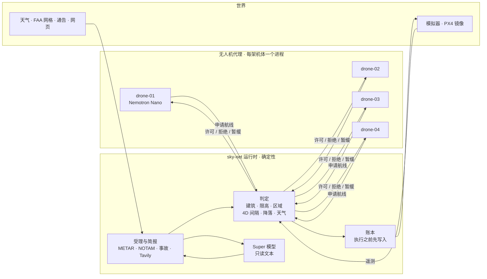

# sky-net

**代理提出申请，运行时签发许可。只有拿到许可的飞行才会动。**

[English](README.md) · [한국어](README.kr.md) · [Español](README.es.md)

- 面向 AI 运营无人机机队的飞行许可运行时。
- 无人机代理（Nemotron 或规则）只提交申请。判定、记录、下达指令都归运行时。
- 判定里没有模型。收紧的规则立即生效，放松的规则要等人来批。


*种子 7，纯规则，没有任何密钥：一条直线擦过一栋 114 m 的建筑，被拒；tick 525 时一份 NOTAM 关闭了 East Village 的急救直升机走廊，穿过它的航线被收回。*



## 运行时看到什么

| 输入 | 来源 | 用途 |
|---|---|---|
| 申请：动作、航线分段、模型记录 | 无人机代理，`POST /proposals` | 判定、记录，然后执行或拒绝 |
| 遥测：位置、高度、状态、tick 时间戳 | 机体适配器，每 0.25 s | 航线符合性、提前起飞、链路中断（15 tick 没有新时间戳） |
| 空域：20 m 及以上的建筑 34,581 栋、FAA UAS 设施地图网格、区域 | `configs/airspace`，第一次许可之前就加载 | 判定 |
| 每一条已许可航线 | 它自己的 4D 意图 | 间隔、降落点、起飞柱 |
| 官方源：NOTAM、召回、天气、事故 | 模拟器公告（代替官方源） | 禁入区、召回、暂停起飞 |
| METAR | aviationweather.gov，每 300 s | 超出 `configs/fleet.yaml` 的限值就全机队暂停起飞 |
| 网页：塔吊、活动、公园关闭、飞行限制 | Tavily；没有密钥时用录制的 fixture | 临时障碍和禁入区，每条都带来源 URL |
| 人工录入的报告 | `POST /intake` | 同样的语法解析和检查，然后等人确认 |
| 人的答复 | 人工审批页 `/approvals.html` | 提前解除规则、暂缓的通告、链路中断卡片 |
| 代理注册 | `POST /agents/register` | 地图上的模型标签，不参与判定 |

## 运行时内部

申请一条一条处理：申请单 → 空域 → 4D 意图 → 策略 → 权限 → 账本 → 指令。

| 部件 | 做什么 | 代码 |
|---|---|---|
| 判定 | 航线、起飞柱、降落共用一套检查：建筑（+50 m）、FAA 限高、区域、横向间距 | `shared/geo.py`（`first_breach`） |
| 意图 | 把已许可航线看成 4D 体积（30 m、25 m、±30 tick）；为失联机体保留空间；链路监视 | `backend/runtime/intents.py` |
| 策略、权限 | 召回和天气暂停起飞；任何时候都要人批的动作 | `backend/runtime/policy.py`、`backend/runtime/authority.py` |
| 锁、仲裁 | 每个停机坪同时只有一个占用者；同一资源上多个已合法申请之间定先后 | `backend/runtime/locks.py`、`backend/runtime/arbiter.py` |
| 账本 | 只追加，写在指令之前；`GET /ledger/report` 每次飞行一行 | `backend/store/ledger.py`、`backend/store/reports/` |
| 下达、适配器 | 通往机体的唯一路径：模拟器 HTTP、MAVLink（PX4）、PX4 镜像 | `backend/runtime/commit.py`、`backend/adapters/` |
| 受理、简报 | 数据源和文本 → 语法解析 → Super 模型（只读文本）→ 代码检查 → 规则 | `backend/intake/book.py`、`backend/intake/briefing.py` |
| 通告 | 每条通告关了什么、从什么时候起、依据谁的话 | `backend/intake/notices.py` |
| 建议 | 反复被拒之后列出合法选项，Super 模型可以推荐其中一条 | `backend/runtime/advisory.py` |
| 存储 | 受理项和规则落盘（SQLite） | `backend/store/intake_store.py` |
| 回放 | 用当时还不存在的规则重跑账本：`python3 scripts/what_if.py --forbid-action reserve_pad` | `backend/store/replay.py`、`scripts/what_if.py` |

- 代理 → 运行时：只有申请。这条链路断了，机体不受影响。
- 运行时 → 机体：指令和遥测。这条链路断了，机体飞完已许可的航线并降落，它的空间继续被保留。
- 模型写申请单、在规划器给出的航线里挑一条、读文本、做摘要。判定永远轮不到模型。每条申请都带
  `params.model_trace`，地图的悬停卡片会显示它。

## 演示

四架无人机从 Brooklyn 一处仓库屋顶出发，送货到 Manhattan 各处的降落区。一轮 5,000 tick（约 17 分钟）。空域
关闭、天气暂停起飞、火情和链路中断发生在固定的 tick 上，其余都由交通状况自己长出来。地图把运行时画在
Lower Manhattan 的联邦大楼 26 Federal Plaza：许可服务不属于任何运营方。

| 场景 | 发生了什么 | 谁决定 |
|---|---|---|
| 直线被拒 | 通往某个停靠点的直线穿过一栋建筑。被拒，并点出建筑名 | 判定 |
| 航线选择 | 规划器画出最多三条合法候选，无人机上的 Nemotron 用 `choose_route(id, reason)` 选一条 | 模型选，判定放行 |
| 飞行途中空域关闭 | tick 525 的一份 NOTAM 关闭了直升机坪走廊，drone-03 正在里面。被召回，22 tick 内从最近的出口离开 | 判定，依据解析出的 NOTAM |
| 交叉冲突 | 两条航线在同一时刻靠到 30 m、25 m 以内。后一条被拒，并点出对方机体；它爬升、等待，或改申请没有冲突的候选 | 判定（4D 意图） |
| 天气暂停起飞 | METAR 阵风 28 kt。一个 tick 之内全机队停止起飞，空中的机体降落。提前解除要人来批 | 代码对照 `configs/fleet.yaml` |
| 降落区附近起火 | 一份报告点出一个地址。建筑周围 150 m 禁入，Gantry Plaza 不可用。种子 7 下没有走廊穿过它 | 语法解析或 Super 读，地址由代码核验 |
| 运行时简报 | 每轮开始时、以及每进入一个新的约 1 km 网格时调用 Tavily：塔吊、活动、关闭、飞行限制。每条规则都注明来源 URL | 语法解析读取，代码核验；只有官方页面才立即生效 |
| 链路中断 | 一架机体失联，飞完已许可的航线并降落。它的走廊继续保留，不再向它发任何指令，恢复后核对位置 | 判定 |
| 运行时建议 | 同一个理由被拒三次。列出合法选项，Super 模型可以推荐其中一条 | 选项由代码生成并检验 |
| PX4 镜像（可选） | drone-01 同时由真实的 PX4（SIH）飞。已许可航线 → 任务；召回也会传到它那里 | 运行时；仍以模拟器为准 |

演示模式（`?demo=1`）跟着这些场景走，字幕是用账本里的代码和数值拼出来的，不是模型写的。碰一下地图会暂停
20 s。`./scripts/demo.sh` 从 tick 0 开始打开它。

## 计分板

同样的四个代理，在同样的规则下接成两种方式：经过运行时，和直连飞控（今天大多数机队的接法）。种子 7，一轮
（`tests/test_two_worlds.py` 里的 `run()`）：

| 计数 | 运行时 | 直连 |
|---|---|---|
| 空域违规 | 0 | 48 |
| 超出限高 | 0 | 13 |
| 未记录的动作 | 0 | 36（它全部 36 个动作） |
| 间隔丧失 | 0 | 3 |
| 天气暂停期间起飞 | 0 | 2 |
| 送达 | 21 | 20 |

运行时这边其余的计数也都是 0：停机坪冲突、闯入区域、超过撤离时间还滞留区域、降落点冲突、闯入事故区、闯入
失联机体的空间、召回之后仍有违规。45 个动作，全部有记录。每个计数怎么算：
[docs/RULES.md](docs/RULES.md#how-the-scoreboard-counts)。

## 快速开始

### 环境要求

| | 最低 | 在 M5 Max 上实测 |
|---|---|---|
| Docker | Docker Engine 24+ 和 Compose 2.24+（macOS 和 Windows 上用 Docker Desktop） | Engine 29.7，Compose 5.5 |
| 整套栈，纯规则或带一个 Nebius 密钥 | 2 个 CPU 核心，给 Docker 4 GB 内存，2 GB 磁盘 | 7 个容器约占 1.5 GB 内存，CPU 远不到一个核心；镜像约 1 GB |
| 用本地模型代替密钥 | 64 GB 内存的 Apple Silicon | 五个 `nemotron-3-nano:4b` 服务，每个约 7.5 GB；下载一次 2.8 GB |
| PX4 SITL（可选） | 再多 1 个 CPU 核心、3 GB 磁盘 | SIH 约占半个核心和 10 MiB；镜像 2.95 GB |
| 不用 Docker | Python 3.12 加 `pyyaml`；地图测试要 Node 22 | |

### 运行

1. 克隆仓库。

   ```sh
   git clone https://github.com/vectordyne-temp/sky-net && cd sky-net
   ```

2. 照示例建一个 `.env.local`。每个值都是可选的：有 `NEBIUS_API_KEY` 和 `TAVILY_API_KEY` 就填上；留空的话，
   整套栈就跑纯规则和录制好的简报。

   ```sh
   cp .env.local.example .env.local
   ```

3. 启动整套栈。

   ```sh
   docker compose -f docker-compose.local.yml --env-file .env.local up --build
   ```

4. 在 http://localhost:3100 打开地图。人工审批：http://localhost:3100/approvals.html · 运行时
   API：:8000 · 模拟器：:8100。

`make up` 把第 2、3 步一次做完。共享的 dev 服务器用自己的那套文件，方式一样：

```sh
cp .env.dev.example .env.dev
docker compose -f docker-compose.dev.yml --env-file .env.dev up -d --build
```

### 模型怎么挑

什么都不是必需的。每个输入各自回退：

| 输入 | 首选 | 其次 | 兜底 |
|---|---|---|---|
| 无人机和运行时用的模型 | `NEBIUS_API_KEY`：Nebius Token Factory 上的 Nemotron（每架无人机一个 Nano，运行时用 Super） | 本地 Ollama：每架无人机一个服务（11435–11438），运行时一个（11439）；没有就用 11434 上的 Ollama 应用 | 纯规则 |
| 网页简报和搜索 | `TAVILY_API_KEY`：实时 Tavily | `tests/fixtures/tavily` 里录制的简报，标成 "recorded" | — |
| 天气 | aviationweather.gov 的 METAR | 模拟的天气报文 | — |

- `scripts/dev.sh` 会自己探测本地的 Ollama，并打印它挑了什么。Docker Compose 不探测宿主机：没有密钥就跑纯
  规则，除非 `.env.local` 指向 Mac 上的 Ollama（见 `.env.local.example` 里的 "docker compose" 段）。
- 纯规则也是完整的一轮：每个场景都会演，本该由模型写的地方，地图上写 "rules"。
- 不管模型写了什么，运行时都拿同一套规则判定。

### 可选的组件

在 local 文件后面追加一个 overlay：
`docker compose -f docker-compose.local.yml -f <overlay> --env-file .env.local up --build`

| Overlay | 加上什么 |
|---|---|
| `sim/docker-compose.sitl.yml` | 一台真实的 PX4 飞控（SIH），跟着 drone-01 飞 |
| `drone/docker-compose.direct.yml` | 直连接法：同样的四个代理自己驱动飞控（计分板的另一列） |

### 不用 Docker

```sh
./scripts/dev.sh      # 自己在 Nebius、本地 Ollama、纯规则之间挑
./scripts/demo.sh     # 干净的种子 7 栈，从 tick 0 开始，用演示模式打开地图
./scripts/sitl.sh     # 同上，外加 drone-01 也由 PX4 SIH 来飞（需要 Docker）
make test             # Python 测试；地图是 node --test tests/test_map.mjs
```

- Tavily 预算：`TAVILY_BUDGET_PER_ROUND`（默认每轮 20 个额度，和搜索共用）。重新简报：
  `curl -X POST http://127.0.0.1:8000/briefing/run`。
- 你多半会改的那些设置，都在 `.env.local.example` 里写了。
- 开发环境怎么搭、要跑哪些检查、pull request 怎么走：[CONTRIBUTING.md](CONTRIBUTING.md)。

## 仓库结构

```
frontend/   地图（MapLibre）和人工审批页：静态文件，前面挡一个不缓存的服务器
backend/    api/: 路由表和进程入口（python -m backend.api.server）
            runtime/: 判定、4D 意图、策略、锁、下达、建议 —— 塔台本身
            intake/: 受理簿、通告、简报台、天气暂停起飞
            store/: 账本、sqlite 受理存储、回放、reports/
            adapters/: 唯一碰机体的代码（模拟器 HTTP、MAVLink、PX4 镜像）
drone/      agent/: 无人机代理 —— 感知、写申请单、规划（A* 候选）、挑选（Nemotron 工具调用）、提交
            direct/: 对照接法 —— 同一个代理自己攥着执行器客户端
shared/     几何、空域、航线规划器、配置、语法解析器、Tavily 和 METAR 客户端、llm/
sim/        世界：种子固定的模拟器、计分板、规则或 cuOpt 派单
configs/    机队、天气限值、简报、FAA 网格、34,581 栋建筑、地址
scripts/    开发和演示启动脚本、PX4 SITL、本地 Ollama 机群、数据抓取
tests/      Python 测试、地图测试、种子固定的双世界测试台
```

每个栈目录都自带 Dockerfile 和可选的 overlay，根目录每个环境放一个 compose 文件。

## 致谢

Changkeun Lee（[@liebertar](https://github.com/liebertar)）和 Dong Jun Kim（[@dejaikeem](https://github.com/dejaikeem)）。
为 Nebius × NVIDIA Global AI Hackathon 的 Physical AI 赛道而作。Apache-2.0：[LICENSE](LICENSE)、
[NOTICE](NOTICE)。
