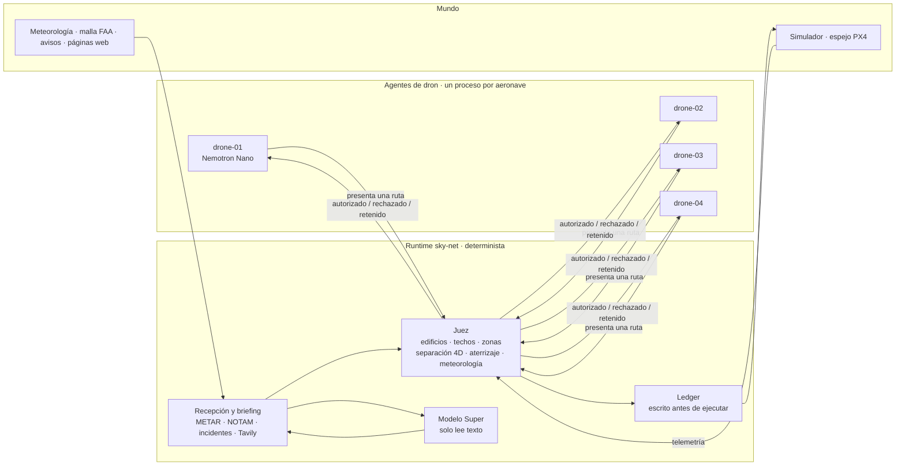

# sky-net

**Los agentes proponen. El runtime autoriza. Solo vuela lo autorizado.**

[English](README.md) · [한국어](README.kr.md) · [中文](README.cn.md)

- Runtime de autorización de vuelo para flotas de drones operadas por IA.
- Los agentes de dron (Nemotron o reglas) solo presentan solicitudes. El runtime juzga, registra y da las órdenes.
- Ningún modelo interviene en el veredicto. Las reglas que restringen se aplican al instante; las que relajan esperan a una persona.


*Semilla 7, solo reglas, sin claves: una recta rozaba un edificio de 114 m y fue rechazada; en el tick 525 un NOTAM cerró el corredor medevac de East Village y las rutas que pasaban por él fueron retiradas.*



## Lo que ve el runtime

| Entrada | Origen | Para qué |
|---|---|---|
| Solicitudes: acción, tramos de ruta, traza del modelo | agentes de dron, `POST /proposals` | se juzgan, se registran y luego se ejecutan o se rechazan |
| Telemetría: posición, altitud, estado, marca de tick | el adaptador de la aeronave, cada 0.25 s | conformidad con la ruta, salidas anticipadas, pérdida de enlace (sin marca nueva durante 15 ticks) |
| Espacio aéreo: 34,581 edificios de 20 m o más, celdas del mapa de instalaciones UAS de la FAA, zonas | `configs/airspace`, cargado antes de la primera autorización | el juez |
| Cada ruta autorizada | sus propias intenciones 4D | separación, zonas de aterrizaje, columnas de despegue |
| Fuente oficial: NOTAM, retiradas, meteorología, incidentes | boletines del simulador (en lugar de las fuentes oficiales) | zonas de exclusión, retiradas, retenciones de despegue |
| METAR | aviationweather.gov, cada 300 s | retención de despegues en toda la flota al superar los límites de `configs/fleet.yaml` |
| Web: grúas, eventos, cierres de parques, restricciones | Tavily; sin clave, fixtures grabados | obstáculos y exclusiones temporales, cada uno con la URL de su fuente |
| Partes introducidos a mano | `POST /intake` | la misma gramática y las mismas comprobaciones, retenidos a la espera de una persona |
| Respuestas humanas | página de aprobación manual, `/approvals.html` | levantar una regla antes de tiempo, avisos retenidos, tarjetas de pérdida de enlace |
| Registro de agentes | `POST /agents/register` | la etiqueta del modelo en el mapa; nunca se juzga |

## Dentro del runtime

Cada solicitud, de una en una: formulario → espacio aéreo → intenciones 4D → políticas → autoridad → ledger → orden.

| Pieza | Qué hace | Código |
|---|---|---|
| Juez | una sola comprobación para rutas, columnas y aterrizajes: edificios (+50 m), techos de la FAA, zonas, márgenes laterales | `shared/geo.py` (`first_breach`) |
| Intenciones | rutas autorizadas como volúmenes 4D (30 m, 25 m, ±30 ticks); espacio reservado para una aeronave muda; vigilancia del enlace | `backend/runtime/intents.py` |
| Políticas, autoridad | retiradas y retenciones por meteorología; acciones que siempre requieren una persona | `backend/runtime/policy.py`, `backend/runtime/authority.py` |
| Bloqueos, árbitro | un titular por plataforma; orden entre solicitudes ya legales que compiten por un recurso | `backend/runtime/locks.py`, `backend/runtime/arbiter.py` |
| Ledger | solo añade, se escribe antes de la orden; una fila por vuelo en `GET /ledger/report` | `backend/store/ledger.py`, `backend/store/reports/` |
| Ejecución, adaptadores | el único camino hasta una aeronave: HTTP del simulador, MAVLink (PX4), espejo PX4 | `backend/runtime/commit.py`, `backend/adapters/` |
| Recepción, briefing | fuentes y texto → gramática → modelo Super (solo texto) → comprobaciones del código → reglas | `backend/intake/book.py`, `backend/intake/briefing.py` |
| Avisos | qué cierra cada aviso, desde cuándo y por orden de quién | `backend/intake/notices.py` |
| Recomendaciones | opciones legales tras rechazos repetidos; el modelo Super puede recomendar una | `backend/runtime/advisory.py` |
| Almacén | entradas de recepción y reglas en disco (SQLite) | `backend/store/intake_store.py` |
| Repetición | vuelve a pasar el ledger bajo una regla que aún no existía: `python3 scripts/what_if.py --forbid-action reserve_pad` | `backend/store/replay.py`, `scripts/what_if.py` |

- Agente → runtime: solo solicitudes. Si ese enlace cae, la aeronave no se ve afectada.
- Runtime → aeronave: órdenes y telemetría. Si ese enlace cae, la aeronave termina su ruta autorizada y
  aterriza; su espacio sigue reservado.
- Los modelos rellenan formularios, eligen entre las rutas del planificador, leen texto y resumen. Nunca el
  veredicto. Cada solicitud lleva `params.model_trace`; el mapa lo muestra en la tarjeta del cursor.

## Demo

Cuatro drones reparten desde la azotea de un almacén en Brooklyn hasta zonas de aterrizaje repartidas por
Manhattan. Una ronda son 5,000 ticks (unos 17 minutos). El cierre, la retención por meteorología, el incendio y
la pérdida de enlace ocurren en ticks fijos; lo demás sale del tráfico. El mapa sitúa el runtime en 26 Federal
Plaza, un edificio federal del Bajo Manhattan: el servicio de autorización no es de ningún operador.

| Escena | Qué pasa | Quién decide |
|---|---|---|
| Recta rechazada | La recta hasta una parada cruza un edificio. Rechazada, con el edificio nombrado | el juez |
| Elección de ruta | El planificador traza hasta tres candidatas legales; el Nemotron del dron elige una con `choose_route(id, reason)` | elige el modelo, autoriza el juez |
| El espacio aéreo se cierra en pleno vuelo | Un NOTAM en el tick 525 cierra un corredor de helipuerto con drone-03 dentro. Se ordena su retirada; sale por la salida más cercana en 22 ticks | el juez, a partir de un NOTAM interpretado |
| Tráfico que se cruza | Dos rutas a menos de 30 m y 25 m en el mismo instante. La segunda se rechaza nombrando a la otra aeronave; sube, espera o presenta la candidata libre | el juez (intenciones 4D) |
| Retención por meteorología | El METAR da rachas de 28 kt. Los despegues quedan retenidos en toda la flota en un tick; las aeronaves en vuelo aterrizan. Levantarla antes requiere una persona | el código contra `configs/fleet.yaml` |
| Incendio junto a una zona de aterrizaje | Un parte nombra una dirección. Exclusión de 150 m alrededor del edificio; Gantry Plaza queda inutilizable. Con la semilla 7 ningún corredor pasa por ahí | lo lee la gramática o el Super, el código comprueba la dirección |
| Briefing del runtime | Tavily al empezar la ronda y en cada celda de ~1 km en la que se entra por primera vez: grúas, eventos, cierres, restricciones. Cada regla cita su URL | lee la gramática, comprueba el código; solo las páginas oficiales se aplican al instante |
| Pérdida de enlace | Una aeronave se queda muda, vuela su ruta autorizada y aterriza. Su corredor sigue reservado; no se le envía nada; al volver se comprueba su posición | el juez |
| Recomendación del runtime | Tres rechazos por el mismo motivo. Se listan las opciones legales; el modelo Super puede recomendar una | el código construye y comprueba las opciones |
| Espejo PX4 (opcional) | drone-01 lo vuela además un PX4 real (SIH). Ruta autorizada → misión; una retirada le llega | el runtime; el simulador sigue siendo el mundo de referencia |

El modo demo (`?demo=1`) sigue las escenas; sus rótulos se componen con códigos y valores del ledger, nunca los
escribe un modelo. Tocar el mapa lo pausa 20 s. `./scripts/demo.sh` lo abre desde el tick 0.

## Marcador

Los mismos cuatro agentes, conectados de dos maneras bajo las mismas reglas: a través del runtime y directos al
piloto automático (como está conectada hoy la mayoría de las flotas). Semilla 7, una ronda (`run()` en
`tests/test_two_worlds.py`):

| Contador | Runtime | Directo |
|---|---|---|
| Infracciones de espacio aéreo | 0 | 48 |
| Techos superados | 0 | 13 |
| Acciones sin registrar | 0 | 36 (las 36 que ejecutó) |
| Pérdidas de separación | 0 | 3 |
| Despegues durante la retención por meteorología | 0 | 2 |
| Entregas | 21 | 20 |

El resto de contadores del runtime también está a 0: conflictos de plataforma, incursiones en zona, permanencia
en zona pasada la hora de salida, conflictos de emplazamiento, incursiones en incidentes, incursiones con el
enlace perdido, infracciones tras una retirada. 45 acciones, todas registradas. Cómo se mide cada contador:
[docs/RULES.md](docs/RULES.md#how-the-scoreboard-counts).

## Inicio rápido

### Requisitos

| | Mínimo | Medido en un M5 Max |
|---|---|---|
| Docker | Docker Engine 24+ con Compose 2.24+ (Docker Desktop en macOS y Windows) | Engine 29.7, Compose 5.5 |
| El stack, solo con reglas o con una clave de Nebius | 2 núcleos de CPU, 4 GB de RAM para Docker, 2 GB de disco | 7 contenedores usan unos 1.5 GB de RAM y bastante menos de un núcleo; las imágenes, cerca de 1 GB |
| Modelos locales en lugar de una clave | Apple Silicon con 64 GB de RAM | cinco servidores `nemotron-3-nano:4b` de unos 7.5 GB cada uno; una descarga de 2.8 GB |
| PX4 SITL (opcional) | 1 núcleo de CPU más, 3 GB más de disco | SIH usa alrededor de medio núcleo y 10 MiB; la imagen ocupa 2.95 GB |
| Sin Docker | Python 3.12 con `pyyaml`; Node 22 para las pruebas del mapa | |

### Arranque

1. Clona el repositorio.

   ```sh
   git clone https://github.com/vectordyne-temp/sky-net && cd sky-net
   ```

2. Crea `.env.local` a partir del ejemplo. Todos los valores son opcionales: añade `NEBIUS_API_KEY` y
   `TAVILY_API_KEY` si las tienes; si los dejas vacíos, el stack funciona con reglas y el briefing grabado.

   ```sh
   cp .env.local.example .env.local
   ```

3. Arranca el stack.

   ```sh
   docker compose -f docker-compose.local.yml --env-file .env.local up --build
   ```

4. Abre el mapa en http://localhost:3100. Aprobación manual: http://localhost:3100/approvals.html · API del
   runtime: :8000 · simulador: :8100.

`make up` hace los pasos 2 y 3 de una vez. Un servidor de desarrollo compartido sigue el mismo camino con sus
propios archivos:

```sh
cp .env.dev.example .env.dev
docker compose -f docker-compose.dev.yml --env-file .env.dev up -d --build
```

### Cómo se eligen los modelos

Nada es obligatorio. Cada entrada baja al siguiente nivel por su cuenta:

| Entrada | Primera opción | Si no | Último recurso |
|---|---|---|---|
| Modelos de los drones y del runtime | `NEBIUS_API_KEY`: Nemotron en Nebius Token Factory (un Nano por dron, Super en el runtime) | Ollama local: un servidor por dron (11435–11438) y uno para el runtime (11439); si no, la app de Ollama en 11434 | solo reglas |
| Briefing web y búsqueda | `TAVILY_API_KEY`: Tavily en vivo | briefing grabado de `tests/fixtures/tavily`, marcado como "recorded" | — |
| Meteorología | METAR de aviationweather.gov | parte meteorológico simulado | — |

- `scripts/dev.sh` busca por su cuenta un Ollama local e imprime qué ha elegido. Docker Compose no sondea el
  host: sin clave funciona solo con reglas, salvo que `.env.local` apunte al Ollama del Mac (ver el bloque
  "docker compose" de `.env.local.example`).
- Solo con reglas la ronda es completa: se ven todas las escenas y el mapa pone "rules" allí donde habría
  escrito un modelo.
- Escriba lo que escriba un modelo, el runtime lo juzga con las mismas reglas.

### Stacks opcionales

Añade un overlay después del archivo local:
`docker compose -f docker-compose.local.yml -f <overlay> --env-file .env.local up --build`

| Overlay | Añade |
|---|---|
| `sim/docker-compose.sitl.yml` | un piloto automático PX4 real (SIH) que refleja a drone-01 |
| `drone/docker-compose.direct.yml` | la conexión directa: los mismos cuatro agentes manejando ellos mismos el piloto automático (la otra columna del marcador) |

### Sin Docker

```sh
./scripts/dev.sh      # elige por su cuenta entre Nebius, Ollama local o reglas
./scripts/demo.sh     # stack limpio con semilla 7 desde el tick 0, abre el mapa en modo demo
./scripts/sitl.sh     # lo mismo, con drone-01 volado también por PX4 SIH (necesita Docker)
make test             # pruebas de Python; el mapa, con node --test tests/test_map.mjs
```

- Presupuesto de Tavily: `TAVILY_BUDGET_PER_ROUND` (20 créditos por ronda por defecto, compartidos con la
  búsqueda). Rehacer el briefing: `curl -X POST http://127.0.0.1:8000/briefing/run`.
- Los ajustes que se suelen tocar están explicados en `.env.local.example`.
- Preparar el entorno de desarrollo, las comprobaciones previas y el flujo de pull request:
  [CONTRIBUTING.md](CONTRIBUTING.md).

## Repositorio

```
frontend/   mapa (MapLibre) y página de aprobación manual: archivos estáticos tras un servidor sin caché
backend/    api/: la tabla de rutas y el punto de entrada del proceso (python -m backend.api.server)
            runtime/: juez, intenciones 4D, políticas, bloqueos, ejecución, recomendaciones — la torre misma
            intake/: el libro de recepción, los avisos, la mesa de briefing, la retención por meteorología
            store/: el ledger, el almacén de recepción en sqlite, la repetición, reports/
            adapters/: el único código que toca una aeronave (HTTP del simulador, MAVLink, espejo PX4)
drone/      agent/: el agente de dron — detectar, formular, planificar (candidatas A*), elegir (llamada de herramienta de Nemotron), presentar
            direct/: la conexión de comparación — el mismo agente con su propio cliente de actuador
shared/     geometría, espacio aéreo, planificador de rutas, configuración, lectores de gramática,
            clientes de Tavily y METAR, llm/
sim/        el mundo: simulador con semilla fija, marcadores, reparto por reglas o con cuOpt
configs/    flota, límites meteorológicos, briefing, malla FAA, 34,581 edificios, direcciones
scripts/    lanzadores de desarrollo y demo, PX4 SITL, flota local de Ollama, descarga de datos
tests/      pruebas de Python, pruebas del mapa, el banco de los dos mundos con semilla fija
```

Cada carpeta de stack lleva su propio Dockerfile y su overlay opcional; la raíz guarda un archivo compose por
entorno.

## Créditos

Changkeun Lee ([@liebertar](https://github.com/liebertar)) y Dong Jun Kim ([@dejaikeem](https://github.com/dejaikeem)).
Hecho para el Nebius × NVIDIA Global AI Hackathon, categoría Physical AI. Apache-2.0: [LICENSE](LICENSE),
[NOTICE](NOTICE).
