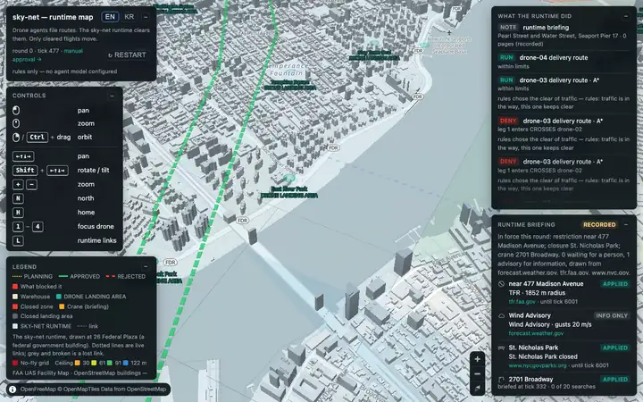
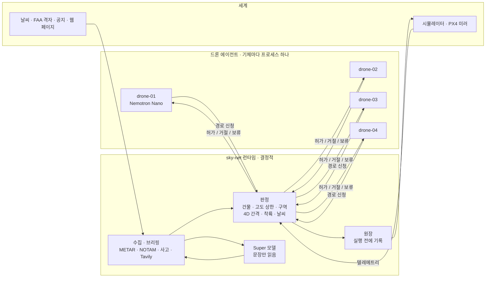

# sky-net

**에이전트는 신청하고, 런타임이 허가한다. 허가받은 비행만 움직인다.**

[English](README.md) · [中文](README.cn.md) · [Español](README.es.md)

- AI가 운용하는 드론 기단을 위한 비행 허가 런타임.
- 드론 에이전트(Nemotron 또는 규칙)는 신청만 한다. 판정·기록·명령은 런타임이 맡는다.
- 판정에는 모델이 끼지 않는다. 조이는 규칙은 바로 적용되고, 푸는 규칙은 사람을 기다린다.



*시드 7, 키 없이 규칙만. 직선이 114 m 건물을 스쳐 거절됐고, 틱 525 에 NOTAM 이 이스트빌리지 응급헬기 회랑을 닫아 그 안을 지나던 허가 경로가 회수됐다.*



## 런타임이 보는 것

| 입력 | 출처 | 쓰임 |
|---|---|---|
| 신청: 행동, 경로 구간, 모델 기록 | 드론 에이전트, `POST /proposals` | 판정하고 기록한 뒤 실행하거나 거절 |
| 텔레메트리: 위치, 고도, 상태, 틱 스탬프 | 기체 어댑터, 0.25초마다 | 경로 준수, 이른 출발, 링크 두절(15틱 동안 새 스탬프가 없을 때) |
| 공역: 높이 20 m 이상 건물 34,581동, FAA UAS 시설 지도 칸, 구역 | `configs/airspace`, 첫 허가 전에 적재 | 판정 |
| 허가된 모든 경로 | 각 경로의 4D 의도 | 간격, 착륙지, 이륙 기둥 |
| 공식 피드: NOTAM, 회수, 날씨, 사고 | 시뮬레이터 공지(공식 피드 대역) | 금지 구역, 회수, 이륙 보류 |
| METAR | aviationweather.gov, 300초마다 | `configs/fleet.yaml` 한도를 넘으면 기단 전체 이륙 보류 |
| 웹: 크레인, 행사, 공원 폐쇄, 비행 제한 | Tavily. 키가 없으면 녹음된 fixture | 임시 장애물·금지 구역. 모두 출처 URL이 붙음 |
| 직접 입력한 보고 | `POST /intake` | 같은 문법과 검사를 거친 뒤 사람 확인까지 보류 |
| 사람의 응답 | 수동 승인 페이지 `/approvals.html` | 규칙 조기 해제, 보류된 공지, 링크 두절 카드 |
| 에이전트 등록 | `POST /agents/register` | 지도의 모델 이름표. 판정에는 쓰지 않음 |

## 런타임 내부

신청은 하나씩 차례로 처리한다: 신청서 → 공역 → 4D 의도 → 정책 → 권한 → 원장 → 명령.

| 부분 | 하는 일 | 코드 |
|---|---|---|
| 판정 | 경로·기둥·착륙을 한 가지 검사로 본다: 건물(+50 m), FAA 고도 상한, 구역, 수평 간격 | `shared/geo.py` (`first_breach`) |
| 의도 | 허가된 경로를 4D 볼륨으로 둔다(30 m, 25 m, ±30틱). 연락이 끊긴 기체의 공간을 예약하고 링크를 감시 | `backend/runtime/intents.py` |
| 정책, 권한 | 회수와 기상 보류. 언제나 사람이 봐야 하는 행동 | `backend/runtime/policy.py`, `backend/runtime/authority.py` |
| 잠금, 중재 | 패드마다 점유자는 하나. 한 자원을 두고 이미 합법인 요청들의 순서를 정함 | `backend/runtime/locks.py`, `backend/runtime/arbiter.py` |
| 원장 | 덧붙이기만 되고 명령보다 먼저 기록. `GET /ledger/report`에서 비행마다 한 줄 | `backend/store/ledger.py`, `backend/store/reports/` |
| 실행, 어댑터 | 기체로 가는 유일한 길: 시뮬레이터 HTTP, MAVLink(PX4), PX4 미러 | `backend/runtime/commit.py`, `backend/adapters/` |
| 수집, 브리핑 | 피드·문장 → 문법 → Super 모델(문장만) → 코드 검사 → 규칙 | `backend/intake/book.py`, `backend/intake/briefing.py` |
| 공지 | 공지마다 무엇을, 언제부터, 누구 말에 따라 막는지 | `backend/intake/notices.py` |
| 권고 | 거절이 반복되면 합법 선택지를 제시. Super 모델이 하나를 추천할 수 있음 | `backend/runtime/advisory.py` |
| 저장소 | 수집 항목과 규칙을 디스크(SQLite)에 보관 | `backend/store/intake_store.py` |
| 재생 | 당시엔 없던 규칙으로 원장을 다시 돌려 본다: `python3 scripts/what_if.py --forbid-action reserve_pad` | `backend/store/replay.py`, `scripts/what_if.py` |

- 에이전트 → 런타임: 신청만 오간다. 이 연결이 끊겨도 기체에는 영향이 없다.
- 런타임 → 기체: 명령과 텔레메트리. 이 연결이 끊기면 기체는 허가받은 경로를 마저 날아 착륙하고, 그 공간은
  계속 예약된다.
- 모델은 신청서를 쓰고, 계획기가 그린 경로 중 하나를 고르고, 문장을 읽고 요약한다. 판정은 하지 않는다. 모든
  신청에는 `params.model_trace`가 붙고 지도의 호버 카드에 보인다.

## 데모

드론 네 대가 브루클린 창고 옥상에서 출발해 맨해튼 곳곳의 착륙장으로 배달한다. 한 판은 5,000틱(약 17분)이다.
공역 폐쇄, 기상 보류, 화재, 링크 두절은 정해진 틱에 일어나고 나머지는 교통 상황에 따라 생긴다. 지도는 런타임을
로어 맨해튼의 연방 정부 건물인 26 Federal Plaza에 그린다. 허가 서비스는 어느 운영사의 것도 아니기 때문이다.

| 장면 | 무슨 일이 일어나나 | 결정하는 쪽 |
|---|---|---|
| 직선 경로 거절 | 배달지까지 직선이 건물을 지난다. 건물 이름과 함께 거절 | 판정 |
| 경로 고르기 | 계획기가 합법 후보를 셋까지 그리고, 드론의 Nemotron이 `choose_route(id, reason)`로 하나를 고른다 | 고르기는 모델, 허가는 판정 |
| 비행 중 공역 폐쇄 | 틱 525에 NOTAM이 헬리패드 회랑을 닫는다. 그 안에 있던 drone-03은 회수되어 22틱 안에 가장 가까운 출구로 빠져나간다 | 판정(해석한 NOTAM 기준) |
| 교차 교통 | 두 경로가 같은 시각에 30 m, 25 m 안으로 가까워진다. 나중 신청은 상대 기체 이름과 함께 거절되고, 상승하거나 기다리거나 겹치지 않는 후보로 다시 신청한다 | 판정(4D 의도) |
| 기상 보류 | METAR 돌풍 28 kt. 한 틱 안에 기단 전체 이륙이 멈추고 떠 있는 기체는 착륙한다. 일찍 풀려면 사람이 필요하다 | 코드가 `configs/fleet.yaml`과 비교 |
| 착륙장 근처 화재 | 보고에 주소가 들어 있다. 건물 둘레 150 m가 금지 구역이 되고 Gantry Plaza는 쓸 수 없다. 시드 7에서는 그곳을 지나는 회랑이 없다 | 문법이나 Super가 읽고, 코드가 주소를 확인 |
| 런타임 브리핑 | 판이 시작될 때와 새로 들어선 약 1 km 칸마다 Tavily로 크레인·행사·폐쇄·제한을 찾는다. 규칙마다 출처 URL을 단다 | 문법이 읽고 코드가 검사. 공식 페이지만 바로 적용 |
| 링크 두절 | 기체 하나와 연락이 끊긴다. 기체는 허가받은 경로를 마저 날아 착륙한다. 회랑은 예약된 채로 두고 아무것도 보내지 않으며, 복구되면 위치를 확인한다 | 판정 |
| 런타임 권고 | 같은 이유로 세 번 거절되면 합법 선택지를 나열한다. Super 모델이 하나를 추천할 수 있다 | 코드가 선택지를 만들고 검사 |
| PX4 미러(선택) | drone-01을 실제 PX4(SIH)로도 날린다. 허가된 경로가 임무가 되고, 회수도 전달된다 | 런타임. 기준 세계는 시뮬레이터 |

지도의 데모 모드(`?demo=1`)는 장면을 따라가며 원장 코드와 값으로만 자막을 만든다. 모델이 쓴 자막은 없다.
지도를 만지면 20초 동안 멈춘다. `./scripts/demo.sh`가 틱 0부터 이 모드로 연다.

## 점수판

같은 에이전트 네 대를 같은 규칙 아래 두 가지로 연결했다. 하나는 런타임을 거치고, 하나는 자동조종장치에 바로
붙는다(지금 대부분의 기단이 이렇게 연결되어 있다). 시드 7, 한 판(`tests/test_two_worlds.py`의 `run()`):

| 항목 | 런타임 | 직결 |
|---|---|---|
| 공역 위반 | 0 | 48 |
| 고도 상한 초과 | 0 | 13 |
| 기록 없는 실행 | 0 | 36 (실행 36건 전부) |
| 간격 상실 | 0 | 3 |
| 기상 보류 중 이륙 | 0 | 2 |
| 배달 | 21 | 20 |

런타임 쪽 나머지 항목도 전부 0이다: 패드 충돌, 구역 침범, 이탈 시간을 넘긴 구역 체류, 착륙지 충돌, 사고 구역
침범, 링크 두절 회랑 침범, 회수 뒤 위반. 실행 45건은 모두 기록되었다. 항목별 측정 방식은
[docs/RULES.md](docs/RULES.md#how-the-scoreboard-counts)에 있다.

## 빠른 시작

### 최소 사양

| | 최소 | M5 Max 실측 |
|---|---|---|
| Docker | Docker Engine 24 이상, Compose 2.24 이상(macOS·Windows는 Docker Desktop) | Engine 29.7, Compose 5.5 |
| 스택(규칙만, 또는 Nebius 키 사용) | CPU 2코어, Docker용 RAM 4 GB, 디스크 2 GB | 컨테이너 7개가 RAM 약 1.5 GB를 쓰고 CPU는 1코어에 한참 못 미침. 이미지 약 1 GB |
| 키 없이 로컬 모델 | Apple Silicon, RAM 64 GB | `nemotron-3-nano:4b` 서버 5개가 각각 약 7.5 GB. 내려받기는 한 번, 2.8 GB |
| PX4 SITL(선택) | CPU 1코어, 디스크 3 GB 추가 | SIH는 약 반 코어, 10 MiB. 이미지 2.95 GB |
| Docker 없이 | Python 3.12와 `pyyaml`. 지도 테스트는 Node 22 | |

### 실행

1. 저장소를 받는다.

   ```sh
   git clone https://github.com/vectordyne-temp/sky-net && cd sky-net
   ```

2. 예시 파일을 복사해 `.env.local`을 만든다. 값은 전부 선택이다. `NEBIUS_API_KEY`와 `TAVILY_API_KEY`가
   있으면 넣고, 비워 두면 규칙과 녹음된 브리핑으로 돈다.

   ```sh
   cp .env.local.example .env.local
   ```

3. 스택을 띄운다.

   ```sh
   docker compose -f docker-compose.local.yml --env-file .env.local up --build
   ```

4. 지도를 연다: http://localhost:3100. 수동 승인: http://localhost:3100/approvals.html · 런타임 API: :8000 ·
   시뮬레이터: :8100.

`make up`은 2·3단계를 한 번에 한다. 공유 dev 서버도 전용 파일로 같은 순서를 밟는다:

```sh
cp .env.dev.example .env.dev
docker compose -f docker-compose.dev.yml --env-file .env.dev up -d --build
```

### 모델은 이렇게 고른다

꼭 있어야 하는 것은 없다. 입력마다 알아서 다음 선택지로 넘어간다:

| 입력 | 첫 번째 | 없으면 | 마지막 |
|---|---|---|---|
| 드론과 런타임의 모델 | `NEBIUS_API_KEY`: Nebius Token Factory의 Nemotron(드론마다 Nano, 런타임에 Super) | 로컬 Ollama: 드론마다 서버 하나(11435–11438)와 런타임용 하나(11439), 없으면 Ollama 앱(11434) | 규칙만 |
| 웹 브리핑·검색 | `TAVILY_API_KEY`: 실시간 Tavily | `tests/fixtures/tavily`의 녹음 브리핑("recorded" 표시) | — |
| 날씨 | aviationweather.gov의 METAR | 시뮬레이션 기상 보고 | — |

- `scripts/dev.sh`는 로컬 Ollama를 스스로 찾아보고 무엇을 골랐는지 출력한다. Docker Compose는 호스트를 찾아보지
  않는다. 키가 없으면 규칙만으로 돌고, `.env.local`이 Mac의 Ollama를 가리킬 때만 그것을 쓴다
  (`.env.local.example`의 "docker compose" 블록 참고).
- 규칙만으로도 온전한 한 판이 돈다. 모든 장면이 나오고, 모델이 썼을 자리에는 지도에 "rules"가 표시된다.
- 모델이 무엇을 쓰든 런타임은 같은 규칙으로 판정한다.

### 선택 스택

로컬 파일 뒤에 overlay를 붙인다:
`docker compose -f docker-compose.local.yml -f <overlay> --env-file .env.local up --build`

| Overlay | 추가되는 것 |
|---|---|
| `sim/docker-compose.sitl.yml` | drone-01을 따라 나는 실제 PX4 자동조종장치(SIH) |
| `drone/docker-compose.direct.yml` | 직결 배선: 같은 에이전트 네 대가 자동조종장치를 직접 조종(점수판의 비교 쪽) |

### Docker 없이

```sh
./scripts/dev.sh      # Nebius, 로컬 Ollama, 규칙 중 알아서 고름
./scripts/demo.sh     # 틱 0부터 깨끗한 시드 7 스택, 지도를 데모 모드로 엶
./scripts/sitl.sh     # 같은 스택에 drone-01을 PX4 SIH로도 비행(Docker 필요)
make test             # Python 테스트. 지도는 node --test tests/test_map.mjs
```

- Tavily 예산: `TAVILY_BUDGET_PER_ROUND`(한 판에 기본 20 크레딧, 검색과 나눠 씀). 다시 브리핑:
  `curl -X POST http://127.0.0.1:8000/briefing/run`.
- 자주 바꾸는 설정은 `.env.local.example`에 설명되어 있다.
- 개발 환경 준비, 올리기 전 검사, PR 흐름은 [CONTRIBUTING.md](CONTRIBUTING.md)에 있다.

## 저장소

```
frontend/   지도(MapLibre)와 수동 승인 페이지. 캐시를 끈 작은 서버가 정적 파일을 낸다
backend/    api/: 경로 표와 프로세스 입구(python -m backend.api.server)
            runtime/: 판정, 4D 의도, 정책, 잠금, 실행, 권고 — 관제탑 그 자체
            intake/: 접수부, 공지, 브리핑 데스크, 기상 대기
            store/: 원장, sqlite 접수 저장소, 재생, reports/
            adapters/: 기체를 만지는 유일한 코드(시뮬레이터 HTTP, MAVLink, PX4 미러)
drone/      agent/: 드론 에이전트 — 감지, 신청서, 계획(A* 후보), 고르기(Nemotron 도구 호출), 신청
            direct/: 비교용 배선 — 같은 에이전트가 조종장치 클라이언트를 직접 가짐
shared/     기하, 공역, 경로 계획기, 설정, 문법 판독기, Tavily·METAR 클라이언트, llm/
sim/        세계: 시드 고정 시뮬레이터, 점수판, 규칙 또는 cuOpt 배차
configs/    기단, 기상 한도, 브리핑, FAA 격자, 건물 34,581동, 주소
scripts/    개발·데모 실행, PX4 SITL, 로컬 Ollama 함대, 데이터 수집
tests/      Python 테스트, 지도 테스트, 시드 고정 두 세계 하네스
```

스택 폴더마다 자기 Dockerfile과 선택 overlay가 있고, 루트에는 환경마다 compose 파일이 하나씩 있다.

## 만든 사람

이창근([@liebertar](https://github.com/liebertar)), 김동준([@dejaikeem](https://github.com/dejaikeem)).
Nebius × NVIDIA Global AI Hackathon, Physical AI 트랙 출품작. Apache-2.0: [LICENSE](LICENSE),
[NOTICE](NOTICE).
