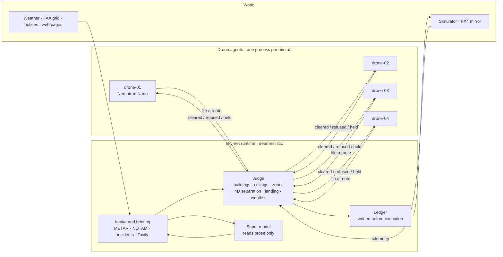

# sky-net

**Agents propose. The runtime clears. Only cleared flights move.**

[한국어](README.kr.md) · [中文](README.cn.md) · [Español](README.es.md)

- Clearance runtime for AI-operated drone fleets.
- Drone agents (Nemotron or rules) only file requests. The runtime judges, logs and commands.
- No model in the verdict. Tightening rules apply at once; loosening waits for a person.


*Seed 7, rules only, no keys: a straight line clipped a 114 m building and was refused; at tick 525 a NOTAM closed the East Village medevac corridor and the routes through it were pulled back.*



## What the runtime sees

| Input | From | Used for |
|---|---|---|
| Filings: action, route legs, model trace | drone agents, `POST /proposals` | judged, logged, then executed or refused |
| Telemetry: position, altitude, state, tick stamp | the aircraft adapter, every 0.25 s | conformance, early departures, lost link (no new stamp for 15 ticks) |
| Airspace: 34,581 buildings of 20 m and taller, FAA UAS facility-map cells, zones | `configs/airspace`, loaded before the first clearance | the judge |
| Every cleared route | its own 4D intents | separation, landing sites, takeoff columns |
| Official feed: NOTAMs, recalls, weather, incidents | simulator bulletins (stand-in for official feeds) | keep-out zones, recalls, takeoff holds |
| METAR | aviationweather.gov, every 300 s | fleet-wide takeoff hold past the limits in `configs/fleet.yaml` |
| Web: cranes, events, park closures, restrictions | Tavily; recorded fixtures without a key | temporary obstacles and keep-outs, each with its source URL |
| Typed reports | `POST /intake` | same grammar and checks, held for a person |
| Human answers | manual approval page, `/approvals.html` | lifting a rule early, held notices, lost-link cards |
| Agent registrations | `POST /agents/register` | the model label on the map; never judged |

## Inside the runtime

Every filing, one at a time: form → airspace → 4D intents → policies → authority → ledger → command.

| Part | Does | Code |
|---|---|---|
| Judge | one check for routes, columns and landings: buildings (+50 m), FAA ceilings, zones, lateral gaps | `shared/geo.py` (`first_breach`) |
| Intents | cleared routes as 4D volumes (30 m, 25 m, ±30 ticks); reserved space for a silent aircraft; link watch | `backend/runtime/intents.py` |
| Policies, authority | recalls and weather holds; actions that always need a person | `backend/runtime/policy.py`, `backend/runtime/authority.py` |
| Locks, arbiter | one holder per pad; order among already-legal requests for one resource | `backend/runtime/locks.py`, `backend/runtime/arbiter.py` |
| Ledger | append-only, written before the command; one row per flight at `GET /ledger/report` | `backend/store/ledger.py`, `backend/store/reports/` |
| Commit, adapters | the only path to an aircraft: simulator HTTP, MAVLink (PX4), PX4 mirror | `backend/runtime/commit.py`, `backend/adapters/` |
| Intake, briefing | feeds and prose → grammar → Super model (prose only) → code checks → rules | `backend/intake/book.py`, `backend/intake/briefing.py` |
| Notices | what each notice closes, from when, on whose word | `backend/intake/notices.py` |
| Advisory | legal options after repeated refusals; the Super model may recommend one | `backend/runtime/advisory.py` |
| Store | intake items and rules on disk (SQLite) | `backend/store/intake_store.py` |
| Replay | re-runs the ledger under a rule that did not exist yet: `python3 scripts/what_if.py --forbid-action reserve_pad` | `backend/store/replay.py`, `scripts/what_if.py` |

- Agent → runtime: filings only. If that link drops, the aircraft is unaffected.
- Runtime → aircraft: commands and telemetry. If that link drops, the aircraft finishes its cleared route and
  lands; its space stays reserved.
- Models write forms, choose among planner routes, read prose and summarise. Never the verdict. Every filing
  carries `params.model_trace`; the map's hover card shows it.

## Demo

Four drones deliver from a warehouse roof in Brooklyn to landing areas across Manhattan. One round is 5,000
ticks (about 17 minutes). The closure, the weather hold, the fire and the lost link happen at fixed ticks; the
rest follows from traffic. The map draws the runtime at 26 Federal Plaza, a federal building in Lower
Manhattan: the clearance service belongs to no operator.

| Scene | What happens | Decided by |
|---|---|---|
| Straight line refused | The straight line to a stop crosses a building. Refused, building named | judge |
| Route choice | The planner draws up to three legal candidates; the drone's Nemotron picks one with `choose_route(id, reason)` | model picks, judge clears |
| Airspace closes mid-flight | A NOTAM at tick 525 closes a helipad corridor with drone-03 inside. Recalled; out by the nearest exit within 22 ticks | judge, from a parsed NOTAM |
| Crossing traffic | Two routes within 30 m and 25 m at the same time. The second is refused with the other aircraft named; it climbs, waits or files the clear candidate | judge (4D intents) |
| Weather hold | METAR gusts 28 kt. Takeoffs held fleet-wide within one tick; airborne aircraft land. Lifting early needs a person | code vs `configs/fleet.yaml` |
| Fire near a landing area | A report names an address. 150 m keep-out around the building; Gantry Plaza unusable. At seed 7 no corridor crosses it | grammar or Super reads, code checks the address |
| Runtime briefing | Tavily at round start and for each newly entered ~1 km cell: cranes, events, closures, restrictions. Every rule cites its URL | grammar reads, code checks; only official pages apply at once |
| Lost link | One aircraft goes dark, flies its cleared route and lands. Its corridor stays reserved; nothing is sent to it; position checked on return | judge |
| Runtime advisory | Three refusals for the same reason. Legal options listed; the Super model may recommend one | code builds and checks the options |
| PX4 mirror (optional) | drone-01 is also flown by a real PX4 (SIH). Cleared route → mission; a recall reaches it | runtime; the simulator stays the world of record |

Demo mode (`?demo=1`) follows the scenes; its captions are assembled from ledger codes and values, never
written by a model. Touching the map pauses it for 20 s. `./scripts/demo.sh` opens it from tick 0.

## Scoreboard

The same four agents, wired two ways under the same rules: through the runtime, and straight to the autopilot
(how most fleets are wired today). Seed 7, one round (`run()` in `tests/test_two_worlds.py`):

| Counter | Runtime | Direct |
|---|---|---|
| Airspace violations | 0 | 48 |
| Ceiling breaches | 0 | 13 |
| Unrecorded actions | 0 | 36 (all of its 36 actions) |
| Separation losses | 0 | 3 |
| Takeoffs during the weather hold | 0 | 2 |
| Deliveries | 21 | 20 |

Every other runtime counter is 0 too: pad conflicts, zone incursions, zone dwell past the exit time, site
conflicts, incident incursions, lost-link incursions, violations after a recall. 45 actions, all recorded.
How each counter is measured: [docs/RULES.md](docs/RULES.md#how-the-scoreboard-counts).

## Quick start

### Requirements

| | Minimum | Measured on an M5 Max |
|---|---|---|
| Docker | Docker Engine 24+ with Compose 2.24+ (Docker Desktop on macOS and Windows) | Engine 29.7, Compose 5.5 |
| The stack, rules only or with a Nebius key | 2 CPU cores, 4 GB RAM for Docker, 2 GB disk | 7 containers use about 1.5 GB RAM and well under one core; images about 1 GB |
| Local models instead of a key | Apple Silicon with 64 GB RAM | five `nemotron-3-nano:4b` servers at about 7.5 GB each; one 2.8 GB download |
| PX4 SITL (optional) | 1 more CPU core, 3 GB more disk | SIH uses about half a core and 10 MiB; the image is 2.95 GB |
| Without Docker | Python 3.12 with `pyyaml`; Node 22 for the map tests | |

### Run

1. Clone the repository.

   ```sh
   git clone https://github.com/vectordyne-temp/sky-net && cd sky-net
   ```

2. Create `.env.local` from the example. Every value is optional: add `NEBIUS_API_KEY` and `TAVILY_API_KEY`
   if you have them; left empty, the stack runs on rules and the recorded briefing.

   ```sh
   cp .env.local.example .env.local
   ```

3. Start the stack.

   ```sh
   docker compose -f docker-compose.local.yml --env-file .env.local up --build
   ```

4. Open the map at http://localhost:3100. Manual approval: http://localhost:3100/approvals.html · runtime
   API: :8000 · simulator: :8100.

`make up` does steps 2 and 3 in one go. A shared dev server works the same way with its own files:

```sh
cp .env.dev.example .env.dev
docker compose -f docker-compose.dev.yml --env-file .env.dev up -d --build
```

### How models are picked

Nothing is required. Each input falls back on its own:

| Input | First choice | Otherwise | Last resort |
|---|---|---|---|
| Models for the drones and the runtime | `NEBIUS_API_KEY`: Nemotron on Nebius Token Factory (Nano per drone, Super at the runtime) | local Ollama: one server per drone (11435–11438) and one for the runtime (11439), else the Ollama app on 11434 | rules only |
| Web briefing and search | `TAVILY_API_KEY`: live Tavily | recorded briefing from `tests/fixtures/tavily`, marked "recorded" | — |
| Weather | METAR from aviationweather.gov | simulated weather report | — |

- `scripts/dev.sh` probes for a local Ollama by itself and prints what it picked. Docker Compose does not probe
  the host: without a key it runs on rules unless `.env.local` points at the Mac's Ollama (see the
  "docker compose" block in `.env.local.example`).
- Rules only is a complete run: every scene plays, and the map says "rules" wherever a model would have written.
- Whatever a model writes, the runtime judges it with the same rules.

### Optional stacks

Add an overlay after the local file:
`docker compose -f docker-compose.local.yml -f <overlay> --env-file .env.local up --build`

| Overlay | Adds |
|---|---|
| `sim/docker-compose.sitl.yml` | a real PX4 autopilot (SIH) mirroring drone-01 |
| `drone/docker-compose.direct.yml` | the direct wiring: the same four agents driving the autopilot themselves (the scoreboard's other column) |

### Without Docker

```sh
./scripts/dev.sh      # picks Nebius, local Ollama or rules by itself
./scripts/demo.sh     # a clean seed-7 stack at tick 0, opens the map in demo mode
./scripts/sitl.sh     # the same, with drone-01 also flown by PX4 SIH (needs Docker)
make test             # Python tests; node --test tests/test_map.mjs for the map
```

- Tavily budget: `TAVILY_BUDGET_PER_ROUND` (default 20 credits per round, shared with search). Brief again:
  `curl -X POST http://127.0.0.1:8000/briefing/run`.
- The settings you are likely to change are described in `.env.local.example`.
- Setting up for development, the checks to run and the pull request flow: [CONTRIBUTING.md](CONTRIBUTING.md).

## Repository

```
frontend/   map (MapLibre) and the manual approval page: static files behind a no-cache server
backend/    api/: the route table and the process entry point (python -m backend.api.server)
            runtime/: judge, 4D intents, policies, locks, commit, advisory — the tower itself
            intake/: the intake book, notices, the briefing desk, the weather hold
            store/: the ledger, the sqlite intake store, replay, reports/
            adapters/: the only code that touches an aircraft (simulator HTTP, MAVLink, PX4 mirror)
drone/      agent/: the drone agent — detect, form, plan (A* candidates), choose (Nemotron tool call), file
            direct/: the comparison wiring — the same agent holding its own actuator client
shared/     geometry, airspace, route planner, config, grammar readers, Tavily and METAR clients, llm/
sim/        the world: seeded simulator, scoreboards, rule or cuOpt dispatch
configs/    fleet, weather limits, briefing, FAA grid, 34,581 buildings, addresses
scripts/    dev and demo launchers, PX4 SITL, local Ollama fleet, data fetchers
tests/      Python tests, map tests, the seeded two-world harness
```

Each stack folder carries its own Dockerfile and optional overlay; the root holds one compose file per
environment.

## Credits

Changkeun Lee ([@liebertar](https://github.com/liebertar)) and Dong Jun Kim ([@dejaikeem](https://github.com/dejaikeem)).
Built for the Nebius × NVIDIA Global AI Hackathon, Physical AI track. Apache-2.0: [LICENSE](LICENSE),
[NOTICE](NOTICE).
